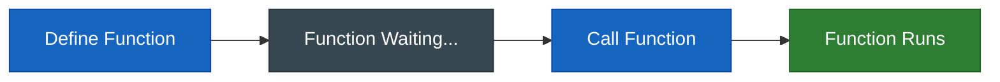
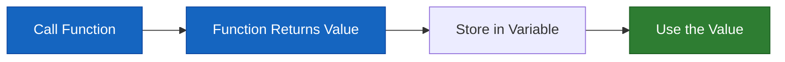
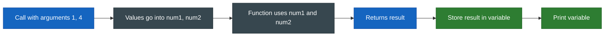
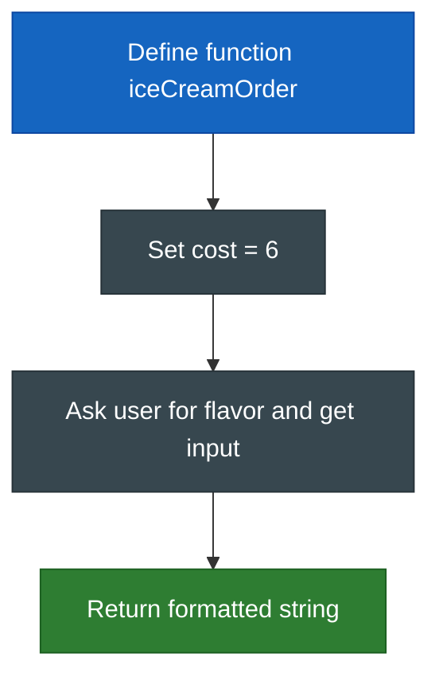

# Lab 03: All About Functions

Welcome to your third lab! Today you'll learn about functions in Python—one of the most important building blocks in programming.

**Before you begin:** Copy and paste the code from this lab into your Zybooks file. You will edit and run your code in Zybooks.

## Learning Objectives

By the end of this lab, you will know how to:

- Define a function using the `def` keyword
- Call a function to execute its code
- Use parameters to pass information into a function
- Use the `return` keyword to get a value back from a function

## The Starter Code

In Zybooks, run the starter code once to define the functions. This loads them into memory so you can use them later.

Here is one example of how a function is declared (the only real Python example in these instructions):

```python
def function_name():
    # code that runs when the function is called
```

Your starter code defines three functions: one that performs an action, one that returns a value, and one that takes parameters. Run that cell in Zybooks.

**Why isn't there any output?**

When you define a function, Python stores it but doesn't run it. Functions only execute when you **call** them. Function calls go either inside the `run()` function at the bottom of your file (when you uncomment a line) or in the main part of your program where you want the function to run.



## How to Test Your Code

Your file has a `run()` function at the bottom. **That is where you should put your function calls when testing.** To test a function:

1. Write or edit your function definition (the code inside the function) in the correct place in the file.
2. Scroll to the `run()` function at the bottom.
3. Uncomment (remove the `#`) from the line that calls the function you want to test.

Example: to test the first function, change `#displayGreeting()` to `displayGreeting()` inside `run()`.

> **Tip**: After testing, add the `#` back so you can test one thing at a time.

---

## Step 1: Performing an Action

The first function (in the starter code) performs an action: it prints text to the console. In your lab it may be named something like `displayGreeting` so it is clear this is your function, not the built-in `print()`.

**Your Task:**

1. Find that function in your Zybooks file.
2. Inside the function, add a new line that prints exactly: **"This is my first function!"**
3. To see it run, go to the `run()` function at the bottom and uncomment the line that calls this function. Then run the file.

Do not write the function call inside the function definition. The **call** (e.g. `displayGreeting()`) belongs in `run()` or in another place where you want the function to execute; the **definition** (the `def` and the code inside it) stays where the starter code put it.

> **Note**: Call the function by its name with parentheses (e.g. `displayGreeting()`). Do not put it inside `print(...)`, because the function already does the printing.

---

## Step 2: Getting a Value Back

The second function does not print anything. It **returns** a value so you can use it elsewhere (e.g. store it in a variable, then print that variable).



**Your Task:**

1. Change the string that this function returns to: **"This is my first return statement!"**
2. Where you want to use the result (e.g. in `run()` or in a small test section), call the function, store the returned value in a variable, then print that variable.

```pseudocode
call the function that returns a value
store the returned value in a variable
print the variable
```

---

## Step 3: Passing Information with Parameters

The third function has two **parameters** (e.g. `num1` and `num2`) in its definition. When you **call** the function, you pass **arguments** (the actual values). Those arguments become the parameter values used inside the function. One definition can be reused with different arguments.



**Your Task:**

1. Review the function definition (no changes needed there).
2. Where you test (e.g. in `run()`), call the function with arguments `1` and `4`, **store the return value in a variable**, then print that variable.
3. Add another call with arguments `5` and `7`, store the result in a variable, and print that variable.
4. Optionally try your own numbers.

```pseudocode
result1 = call function with arguments 1 and 4
print result1
result2 = call function with arguments 5 and 7
print result2
```

---

## Step 4: Putting It All Together: The Ice Cream Order Example

Now you will write a new function from scratch that uses a variable, gets user input, and returns a formatted string.



**Your Task:**

1. **Define** a function named `iceCreamOrder` that takes no parameters.
2. Inside the function, create a variable `cost` and set it to `6`.
3. Ask the user for a flavor using `input()` with the prompt `"What flavor would you like? => "` and store the result in a variable (e.g. `flavor`). Do this once—asking and getting the input in one step.
4. **Return** an f-string that says: `"The [flavor] will cost [cost] dollars."` (using your variable names inside the f-string).
5. Where you test (e.g. in `run()` or below your definitions), call `iceCreamOrder()`, store the returned string in a variable, and print that variable.

```pseudocode
define function iceCreamOrder with no parameters
    cost = 6
    flavor = ask user "What flavor would you like? => "
    return "The [flavor] will cost [cost] dollars."

// where you test:
order = call iceCreamOrder()
print order
```

No full solution code is provided for this step; use the steps above and the concepts from the lab to write it yourself in Zybooks.

---

## Lab Complete!

Great work! You've learned the basics of Python functions.

**Summary:**

```pseudocode
Define:    function name with optional parameters
Call:      function name with arguments where you want it to run (e.g. inside run())
Return:    send a value back; caller can store it in a variable
Parameters: define in function header; pass arguments when you call
```
