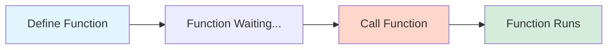
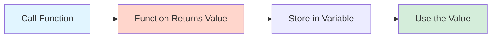
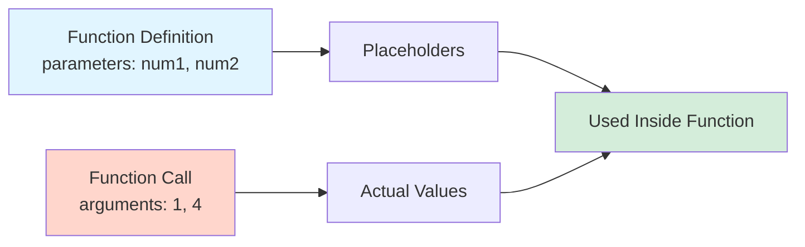
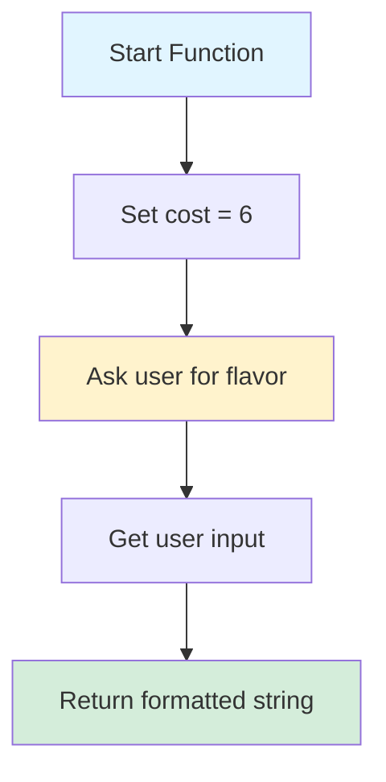

# Lab 03: All About Functions 🚀

Welcome to your third lab! Today you'll learn about functions in Python—one of the most important building blocks in programming.

## Learning Objectives

By the end of this lab, you will know how to:

- Define a function using the `def` keyword
- Call a function to execute its code
- Use parameters to pass information into a function
- Use the `return` keyword to get a value back from a function

## The Starter Code

Run this code to define the functions we'll work with:

```python
def printStatement():
    print("Welcome to your third lab!")

def returnValues():
    return "Welcome to your third lab!"

def parameters(num1, num2):
    multiplication = num1 * num2
    return multiplication
```

**Why isn't there any output?** ❓

When you define a function, Python stores it but doesn't run it. Functions only execute when you **call** them!



## How to Test Your Code 🧪

Your file has a `run()` function at the bottom. To test a function, uncomment (remove the `#`) from the line that calls it.

**Example:** Change `#printStatement()` to `printStatement()`

```python
def run():
    #printStatement()
    #returnValues()
    #print(parameters(1,4))
    return #Do NOT change this line!
```

> ⭐ **Tip**: After testing, add the `#` back to test one thing at a time.

---

## Step 1: Performing an Action 🎬

The `printStatement` function performs an action: it prints text to the console.

**Your Task:**

Add a new print statement inside the function that prints: `"This is my first print statement!"`

```python
def printStatement():
    print("Welcome to your second lab!")
    # YOUR CODE HERE: Add a new print statement below.
    print("This is my first print statement!")

# Call the function to see your changes!
printStatement()
```

> ⭐ **Note**: We call `printStatement()` directly, not `print(printStatement())`, because the function does the printing itself.

---

## Step 2: Getting a Value Back 🎁

The `returnValues` function doesn't print anything. Instead, it **returns** a value that can be used elsewhere.



**Your Task:**

1. Change the string being returned to: `"This is my first return statement!"`
2. Run the code to see the result

```python
def returnValues():
    # YOUR CODE HERE: Change the string being returned.
    return "This is my first return statement!"

# Store the returned value and print it
result = returnValues()
print(result)
```

---

## Step 3: Passing Information with Parameters 📥

The `parameters` function has `num1` and `num2` in parentheses. These are **parameters**—placeholders for values you provide when calling the function. The values you pass in are called **arguments**.



**Your Task:**

1. Review the function (no changes needed)
2. Add a call with arguments `5` and `7`
3. Try calling it with your own numbers!

```python
def parameters(num1, num2):
    multiplication = num1 * num2
    return multiplication

# Call the function with different arguments
print(parameters(1, 4))
# YOUR CODE HERE: Call with 5 and 7
print(parameters(5, 7))
```

---

## Step 4: Putting It All Together: The Ice Cream Order 🍦

Now you'll create a function from scratch that combines everything you've learned!



**Your Task:**

Follow the numbered comments to build your `iceCreamOrder` function:

```python
# 1. Define a function called iceCreamOrder (no parameters)
def iceCreamOrder():
    # 2. Create a variable `cost` and set it to 6
    cost = 6
    # 3. Ask the user for flavor using input()
    flavor = input("What flavor would you like? => ")
    # 4. Return an f-string: f"The {flavor} will cost {cost} dollars."
    return f"The {flavor} will cost {cost} dollars."

# Test your function
print(iceCreamOrder())
```

---

## ✅ Lab Complete!

Great work! You've learned the basics of Python functions.

**Summary:**
- **Define**: `def function_name():`
- **Call**: `function_name()`
- **Return**: `return value`
- **Parameters**: `def my_func(param1, param2):`

---

*Happy coding! 🎉*
